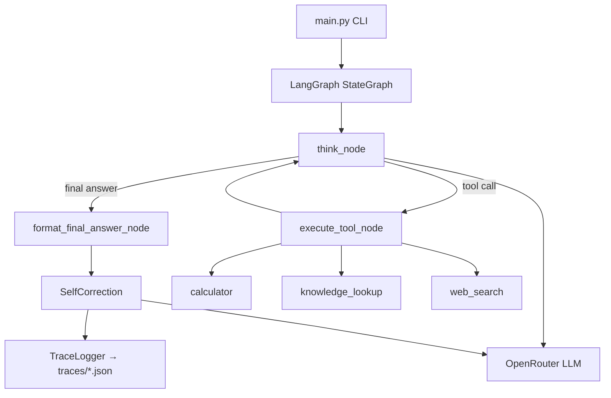

# Zen Multi-Agentic Workflow

A Python ReAct-style analytical agent that answers multi-step financial questions by dynamically selecting tools, logging its reasoning, and self-correcting when errors are found.

## What This Is

This project implements a **Reason + Act (ReAct)** agent for multi-step analytical queries. Given a natural-language question, the agent:

1. **Reasons** about what information it needs
2. **Acts** by calling one of three tools (calculator, knowledge lookup, or web search)
3. **Observes** the tool result and repeats until it can produce a final answer
4. **Self-corrects** by running a separate LLM verification pass over the full trace

It is built for questions that require combining calculation, reference lookup, and live web data — for example, comparing P/E ratios of two companies using current stock prices and earnings.

The LLM runs through [OpenRouter](https://openrouter.ai/) (default model: `openai/gpt-4o`). Web search uses the [Exa API](https://exa.ai/).

## Approach

### Custom LangGraph StateGraph (not `create_react_agent`)

The agent uses a **custom LangGraph `StateGraph`** rather than LangChain's prebuilt ReAct helper. This allows a post-hoc self-correction step that inspects and optionally re-runs tool calls after the main loop completes.

```
START → think → should_continue?
                  ├─ continue → execute_tool → think (loop)
                  └─ end      → format_final_answer → END
```

After the graph finishes, `SelfCorrection` reviews the trace for arithmetic errors, logical inconsistencies, and source grounding issues, then re-runs affected tool steps (up to 2 correction cycles).

### Structured ReAct parsing

Each step follows the **Thought / Action / Action Input** pattern. The LLM output is parsed by a custom `ReActParser` (`utils/parser.py`) with regex fallback when structured output is malformed.

### Three tools, one interface

Every tool exposes the same contract:

```python
def run(action_input: str) -> str
```

| Tool | Purpose |
|------|---------|
| `calculator` | Executes sandboxed Python math in a subprocess (blocked imports, 30s timeout) |
| `knowledge_lookup` | Keyword search over local financial reference files in `data/knowledge_base/` |
| `web_search` | Live web search via the Exa API |

Tool errors always return structured observation strings — never raw exceptions or empty results.

### Safety limits

| Constant | Value | Purpose |
|----------|-------|---------|
| `MAX_ITERATIONS` | 10 | Max ReAct steps per query |
| `MAX_CORRECTION_CYCLES` | 2 | Max self-correction re-runs |
| `MAX_WALL_CLOCK_SECONDS` | 120 | Total CLI timeout |
| `MAX_TOOL_TIMEOUT` | 30 | Per-tool execution timeout |

### Trace logging

Every run produces a JSON trace with step-by-step `thought`, `action`, `action_input`, and `observation` fields. Corrections are appended as separate entries with before/after diffs. Traces are saved to `traces/`.

## Requirements

- Python **3.11+**
- [OpenRouter API key](https://openrouter.ai/keys) (required)
- [Exa API key](https://exa.ai/) (required for web search; complex queries need it)

## Setup

### 1. Clone and enter the project

```bash
git clone <repository-url>
cd zen-multi-agentic-workflow
```

### 2. Create a virtual environment (recommended)

```bash
python3 -m venv .venv
source .venv/bin/activate   # macOS/Linux
# .venv\Scripts\activate    # Windows
```

### 3. Install dependencies

```bash
pip install -e .
```

Verify the install:

```bash
python -c "import agent; import tools; import utils; print('OK')"
```

### 4. Configure environment variables

Copy the example env file and add your API keys:

```bash
cp .env.example .env
```

Edit `.env`:

```env
OPENROUTER_API_KEY=your_openrouter_key_here
EXA_API_KEY=your_exa_key_here
OPENROUTER_MODEL=openai/gpt-4o
```

Alternatively, export them in your shell:

```bash
export OPENROUTER_API_KEY=your_key
export EXA_API_KEY=your_key
```

## Usage

### Run a single query

Pass the question as a CLI argument:

```bash
python main.py "What is 15% of \$45,000?"
```

Or pipe via stdin:

```bash
echo "What is the current yield of a bond with a 5% coupon trading at \$980?" | python main.py
```

Output includes the final answer and the path to a timestamped trace file under `traces/`.

## Testing

### Quick smoke tests (no LLM calls)

These verify tools and imports without API keys:

```bash
# Calculator
python -c "from tools.calculator import run; print(run('2+2'))"
# Expected: Result: 4

# Knowledge lookup
python -c "from tools.knowledge_lookup import run; print(run('current yield'))"
# Expected: snippet containing yield formula

# Graph compiles
python -c "from agent.graph import create_agent_graph; create_agent_graph(); print('OK')"
```

### End-to-end test suite

Run all three financial test queries (simple, medium, complex). **Requires `OPENROUTER_API_KEY` and `EXA_API_KEY`.**

```bash
python test_queries.py
```

This runs:

| Query | Question | Expected behavior |
|-------|----------|-------------------|
| **simple** | What is 15% of $45,000? | Calculator only; answer contains **6750** |
| **medium** | Current yield of a 5% coupon bond at $980 | Knowledge lookup + calculator; yield ≈ **5.1%** |
| **complex** | Compare Apple vs Microsoft P/E ratios | All 3 tools; web data + formulas + calculation |

Traces are saved to `traces/simple.log`, `traces/medium.log`, and `traces/complex.log`. The script validates trace structure (steps with thought/action/observation fields).

### Manual single-query checks

```bash
# Simple — should answer ~$6,750
python main.py "What is 15% of \$45,000?"

# Medium — should use knowledge lookup + calculator
python main.py "What is the current yield of a bond with a 5% coupon trading at \$980?"

# Complex — should use all three tools
python main.py "Compare the P/E ratios of Apple and Microsoft based on their latest earnings and current stock prices"
```

Inspect a trace:

```bash
python -c "import json; print(json.dumps(json.load(open('traces/simple.log')), indent=2))"
```

Look for self-correction entries:

```bash
grep -l '"type": "correction"' traces/*.log
```

### Tool-only tests

```bash
# Web search (needs EXA_API_KEY)
python -c "from tools.web_search import run; print(run('Apple stock price')[:300])"

# Calculator error handling
python -c "from tools.calculator import run; print(run('1/0'))"
# Expected: Error: ...
```

## Project Structure

```
zen-multi-agentic-workflow/
├── agent/
│   ├── graph.py          # LangGraph StateGraph definition
│   ├── nodes.py          # think, execute_tool, format_final_answer nodes
│   ├── prompts.py        # System prompts for ReAct and self-correction
│   ├── state.py          # AgentState TypedDict
│   └── correction.py     # Post-hoc trace verification and re-runs
├── tools/
│   ├── calculator.py     # Sandboxed Python code executor
│   ├── knowledge_lookup.py
│   └── web_search.py     # Exa API integration
├── utils/
│   ├── config.py         # Limits and env var loading
│   ├── logger.py         # JSON trace logger
│   └── parser.py         # ReAct output parser
├── data/knowledge_base/  # Local financial reference data
├── main.py               # CLI entry point
├── test_queries.py       # End-to-end test runner
└── traces/               # Generated trace logs (gitignored)
```

## Architecture



## License

See repository license file if present.
